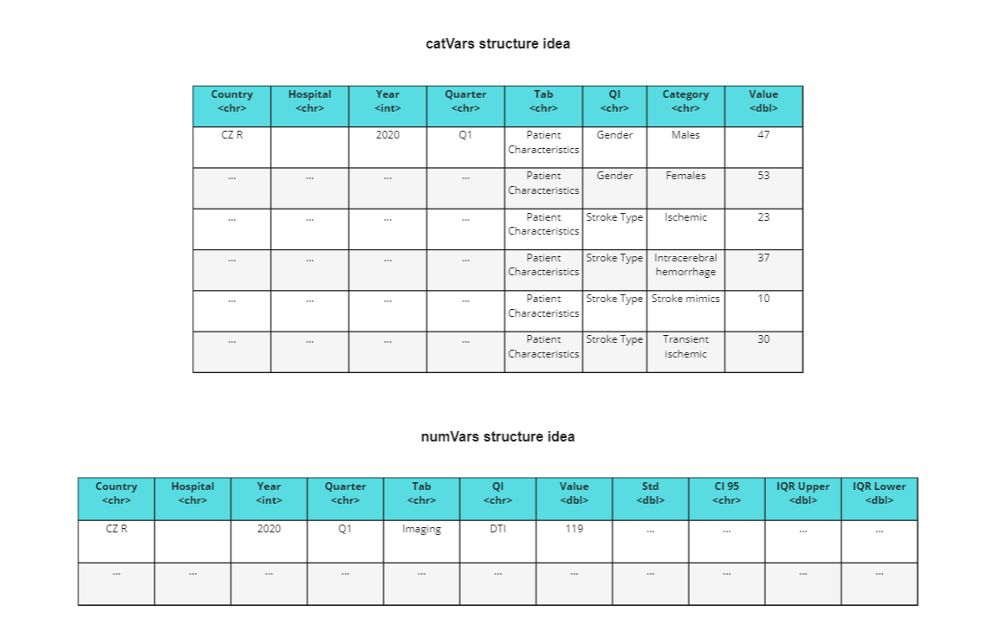
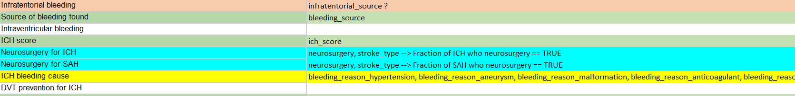
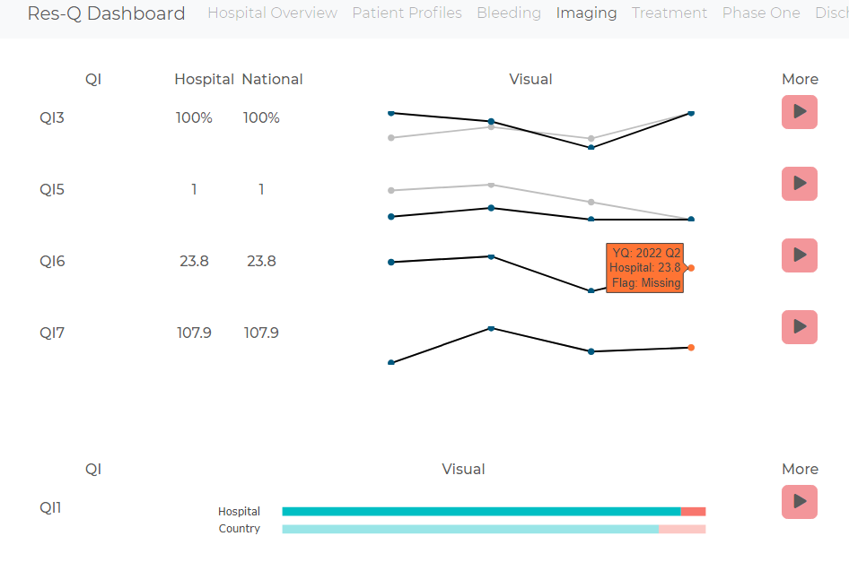

# Dashboard - Hospital Stroke Care Quality

A prototype dashboard developed during my data science internship at Aalborg University Human Machine Interaction group to allow hospitals to monitor and visualise stroke care quality indicators.

## Problem Statement

Stroke care quality data is crucial for determining the quality of hospital care for stroke patients. Yet, with large volumes of data, experts often struggle to identify key insights as the signal can be buried in the noise.

Dashboards address this challenge by providing at-a-glance visualisations that highlight the most important metrics and trends. The task is to develop a dashboard prototype displaying stroke care quality indicators (QIs) subject to the following criteria:

1. It will contain a set of QIs defined by medical experts as necessary for stroke care
2. The QIs will be aggregated per hospital per quarter
3. Numerical indicators will be visualised on a quarterly trendline
4. Categorical indicators will be visualised on a stacked bar graph

## Data Description

The dataset was provided by [RES-Q+](https://www.resqplus.eu/), an organization that collects and manages stroke care quality data worldwide. Its goal is to give hospitals a centralized registry where they can monitor and compare stroke care trends within and across countries, ultimately supporting improvements in stroke treatment quality.

The dataset consisted of anonymised data from nine different hospitals in three different countries. Each entry, logged by hospital staff for stroke patients, included 270 columns, resulting in 80k+ entries.
As is common with real-world datasets, pre-processing was required to handle missing and erroneous entries. Missing values were flagged as 'NA' (Not Available). Erroneous entries were removed by detecting and excluding extreme outliers in columns where outlier detection was straightforward, such as patient age.

#### Data Transformation

For future aggregation, the data was transformed into two different tabular data structures:

1. numVars: containing the numerical data
2. catVars: containing the categorical data

These are shown in the figure below.

## Metric Aggregation

The dataset had to be aggregated into 128 quality indicators (QIs) across 7 categories as seen in the table below. The aggregation functions were mostly the mean/median for numerical QIs and percentage breakdowns for categorical QIs.

| Category                   | Number of QIs | Numerical | Categorical |
| -------------------------- | ------------- | --------- | ----------- |
| Patient Characteristics    | 45            | 7         | 38          |
| Bleeding                   | 9             | 0         | 9           |
| Imaging                    | 10            | 4         | 6           |
| Treatment                  | 18            | 6         | 12          |
| Phase One (initial 3 days) | 12            | 0         | 12          |
| Discharge                  | 20            | 3         | 17          |
| ESO Angel Awards           | 10            | 10        | 0           |

In order to map the columns to QIs, preliminary mappings were defined. These were constructed based on my judgement and research pending medical expert confirmation, as the dataset did not come with a QI mapping of its own. It was colour coded to signify the correctness likelihood of the mapping, where:
- Green: Most likely true
- Orange: Uncertain
- Yellow: Can be constructed from several columns
- Teal: Can be constructed through logic between columns
- White: Unknown

#### Visualisations

Visualisations followed the requirements. When quarterly data was missing (some hospitals were more up to date than others), the country aggregate was used instead and a red visual indicator was given to demonstrate missing quarterly data. Stakeholders can immediately identify missing quarterly data (red flag indicator).

#### QI ↔ Data Interface Abstraction

In order to promote modularity and easy onboarding of future QIs, I created an interface between an excel sheet and the data aggregation logic. The interface parsed the excel sheet so that future QIs were easily added even by non-technical stakeholders. A screenshot of how it looked is given below.

## Architecture

The dashboard app is built using R Shiny. It consists of two layers:

1. A UI layer → handles layout and visualisation components
2. A server layer → manages data aggregation, processing and dynamic updates based on user interactions

The relation between the code architecture and the dashboard are illustrated below. The first diagram demonstrates the overall code architecture, mapping modules and data flow to the dashboard components. The second image shows how real QI data is rendered in the dashboard.

